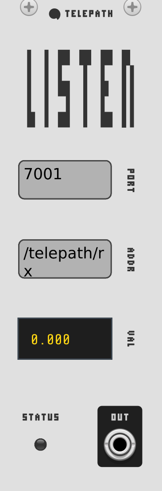
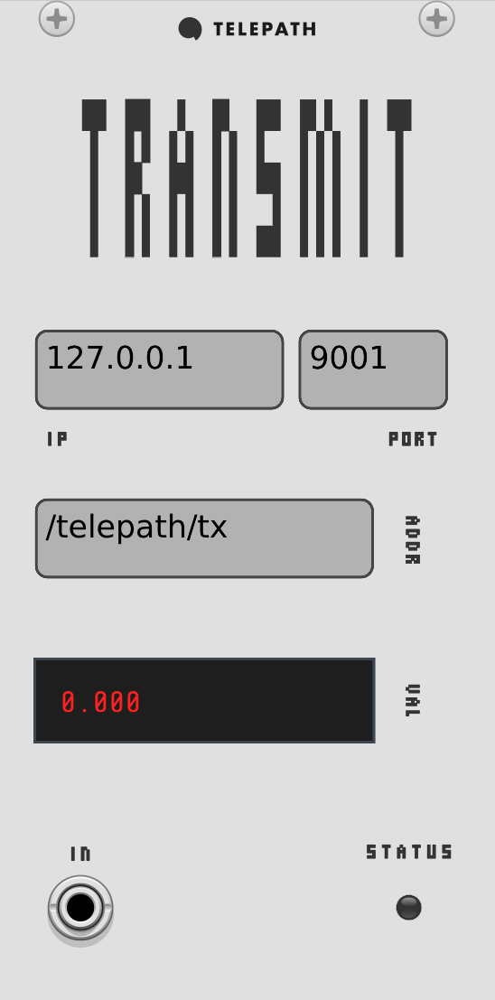
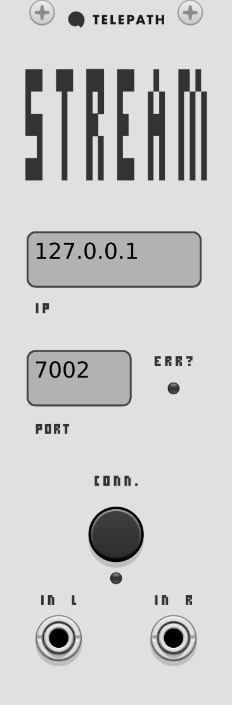
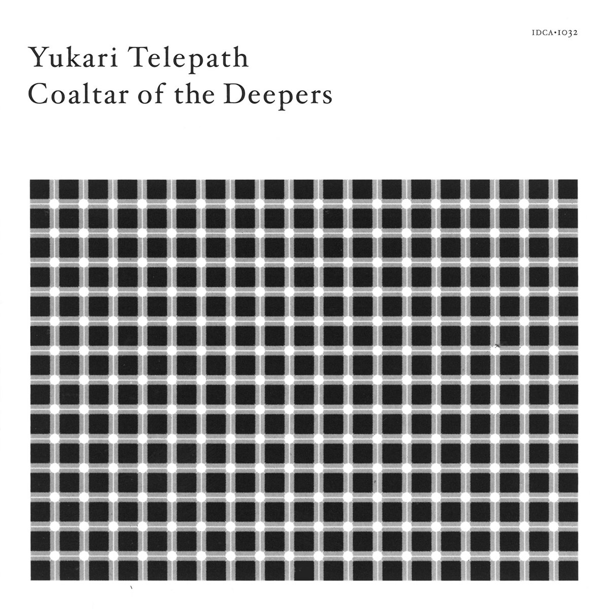

# Telepath (VCVRack)

*Telepath* is a bi-directional communication bridge between VCV Rack and Unity, enabling real-time interaction between your game and modular synthesizer patches. This repo, 1/2 of *Telepath*, contains a collection of VCVRack modules for receiving control voltages from Unity, sending modulation signals back, and streaming audio directly into Unity's audio system.

The other half of *Telepath* (native plugin for Unity) can be found [here](https://github.com/teriyake/Telepath_Unity/tree/main).

## Overview

The Telepath system consists of three VCVRack modules:

1. **Telepath Listen** - Receives OSC messages from Unity and converts them to CV signals
2. **Telepath Transmit** - Sends CV signals from your patch to Unity as OSC messages
3. **Telepath Stream** - Streams audio from your patch directly into Unity's audio system

With these modules, it is possible to achieve interactive, responsive game audio that reacts dynamically to gameplay events and can additionally influence game behaviors in return.

## Modules 

### Telepath Listen



**Telepath Listen** receives OSC messages from Unity and converts them to control voltages for your patch.

#### Features
- Addressable input channel with configurable OSC paths
- Input value display for real-time monitoring
- Automatic scaling of incoming values to standard CV range (-5V to +5V or 0V to +10V)
- Status LED indicates active connection
- Hot-swappable OSC port configuration
- Single input/output for now (multi-channel support coming soon...)

#### Inputs & Outputs
- **OSC Input**: The input channel has a configurable OSC address (e.g., `/telepath/playerHealth`)
- **CV Output**: The output jack provides control voltage corresponding to the received values

#### Parameters
- **PORT**: OSC listening port (default: 7001)
- **IP**: localhost 

### Telepath Transmit



**Telepath Transmit** sends CV signals from your patch to Unity as OSC messages.

#### Features
- 1 addressable output channel with configurable OSC paths (multi-channel support coming soon...)
- Output value display for real-time monitoring
- Automatic scaling of outgoing CV to normalized values
- Configurable transmission rate to optimize network performance
- Status LED indicates active connection

#### Inputs & Outputs
- **CV Input**: 1 input jack accepting standard CV signals

#### Parameters
- **IP**: Destination IP address (default: 127.0.0.1)
- **PORT**: OSC destination port (default: 7001)
- **OSC Path**: Configurable path (default: `/telepath/tx`)

### Telepath Stream



**Telepath Stream** sends audio from your patch directly to Unity.

#### Features
- Stereo audio streaming via UDP
- Configurable sample rate and buffer size
- Switch for toggling transmission
- Auto-reconnect functionality
- Status LED indicates active streaming

#### Inputs & Outputs
- **L/R Inputs**: Stereo audio inputs

#### Parameters
- **IP**: Destination IP address (default: 127.0.0.1)
- **PORT**: Audio streaming port (default: 7002)


## Installation
**Compatibility Note:** Currently, the pre-built modules are provided for **macOS (Intel & Apple Silicon Universal)** only. Windows and Linux support is planned. You can build from source for other platforms if needed.

1. Download the latest Telepath release from the [releases page](https://github.com/teriyake/Telepath_VCVRack/releases)
2. Extract the ZIP file to your VCVRack plugins folder:
   - macOS: `Documents/Rack2/plugins/`
3. Restart VCV Rack
4. Add Telepath modules to your patch from the module browser

Alternatively, you can build the modules from source:
1. Clone this repo: 
```bash
git clone https://github.com/teriyake/Telepath_VCVRack Telepath_VCV && cd Telepath_VCV
```
2. Build:
```bash
chmod +x ./build.sh && ./build.sh
```
3. Copy `dist/Telepath` to your VCVRack plugins folder

## Getting Started

### Basic Setup

1. Add the **Telepath Listen** module to your patch
2. Configure the port to match your Unity application's Telepath settings (default: 7001)
4. Send values from Unity using `TelepathManager.SendGameData("paramName", value)`
5. Connect the **Telepath Listen** output jacks to your other modules

### Creating a Responsive Soundtrack

Here's a simple example of how we might use Telepath for achieving real-time responsive game audio:

1. Use **Telepath Listen** to receive `player health`, `player position`, and `combat intensity`
2. Route `player health` cv to control filter cutoff frequency
3. Use `player position` to modulate stereo placement or reverb size
4. Map `combat intensity` to percussion density and overall volume
5. Send the final mix to **Telepath Stream** for playback in Unity

This is just one approach, and you can do a lot of cool things!

### Sending Control Back to Unity

1. Add **Telepath Transmit** to your patch
2. Connect interesting modulation sources to the input 
3. Configure OSC addresses for each channel (e.g., `/telepath/lfo`)
4. In Unity, listen for these messages using `TelepathManager.GetNextOscMessage()`
5. Use received values to control game elements like particle systems, lighting, or camera effects...

## Technical Notes

### OSC Message Format
Telepath uses standard OSC messages over UDP:
`/telepath/yourParameterName floatValue`

### Performance Considerations
- High transmission rates (> 60Hz) may impact CPU usage
- Audio streaming requires reasonable network bandwidth
- Consider reducing polyphony when streaming high-quality audio

### Multiple Instances
- You can use multiple Telepath modules in a single patch
- Different modules can be configured to use different ports
- Consider using different OSC path prefixes for organization

## Additional Resources

- [Telepath Unity Plugin](https://github.com/teriyake/Telepath_Unity)
- [OSC Protocol Specification](https://opensoundcontrol.stanford.edu/spec-1_0.html)
- [VCV Rack Manual](https://vcvrack.com/manual/)

## License

MIT

## Acknowledgments

-   [OSCPack](https://opensoundcontrol.stanford.edu/implementations/oscpack.html) library for the C++ OSC implementation.
-   The [VCVRack](https://vcvrack.com) community and developers.

---

